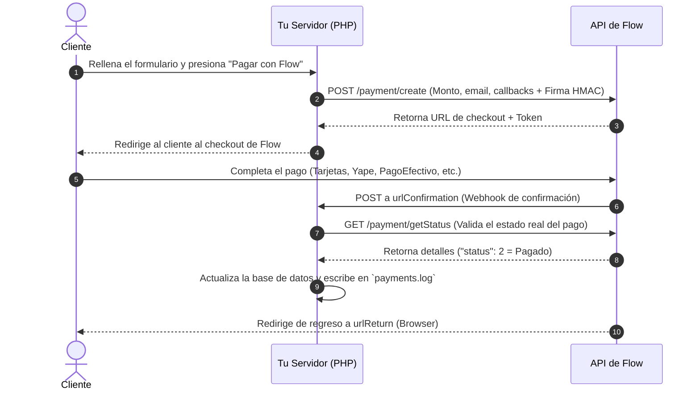

# Integración de Flow.cl

Este repositorio es una aplicación web independiente (self-contained) en **PHP** diseñada para demostrar y explicar el funcionamiento de la pasarela de pagos de **Flow.cl**.

> [!WARNING]
> **ENTORNO DE PRODUCCIÓN ACTIVO**: Si configuras `FLOW_SANDBOX="false"`, la aplicación procesará transacciones reales que cobrarán dinero verdadero. Se recomienda realizar pruebas en Sandbox (`FLOW_SANDBOX="true"`) antes de operar comercialmente.

---

## 1. Estructura del Proyecto

* **[index.php](file:///C:/Users/Richard/Documents/trabajo/proyectos%20personales/RAPI%20GOD/index.php)**: El punto de entrada principal. Contiene la interfaz de usuario y las rutas internas para:
  - Crear el pago (`action=pay`).
  - Recibir el webhook de confirmación (`action=confirm`).
  - Mostrar la pantalla de éxito o error al retornar el cliente (`action=return`).
* **[FlowService.php](file:///C:/Users/Richard/Documents/trabajo/proyectos%20personales/RAPI%20GOD/FlowService.php)**: Clase encargada de firmar los parámetros vía HMAC-SHA256 y realizar las peticiones cURL a la API de Flow.cl.
* **[test_flow.php](file:///C:/Users/Richard/Documents/trabajo/proyectos%20personales/RAPI%20GOD/test_flow.php)**: Script de prueba para consola/CLI.
* **[env-loader.php](file:///C:/Users/Richard/Documents/trabajo/proyectos%20personales/RAPI%20GOD/env-loader.php)**: Lector ligero de variables de entorno para desarrollo local.

---

## 2. Flujo de Funcionamiento y Prueba

Para realizar un cobro de prueba, la aplicación interactúa con la API de Flow de la siguiente manera:

1. **Creación del Pago**: Al enviar el formulario de pago, el servidor genera una orden con un ID único (`commerceOrder`) y calcula la firma HMAC-SHA256 con tu `SecretKey`. Esta orden es registrada en Flow llamando al endpoint `/payment/create`.
2. **Redirección**: El cliente es enviado temporalmente a la pantalla de pago seguro provista por Flow para realizar la transacción.
3. **Webhook de Confirmación (urlConfirmation)**: Tras el pago, los servidores de Flow envían una llamada POST en segundo plano a tu endpoint de confirmación. Tu servidor consulta el estado oficial a la API de Flow vía `/payment/getStatus`, confirma la validez de la firma y procesa la orden (en este caso de prueba, registrando los datos en `payments.log`).
4. **Pantalla de Retorno (urlReturn)**: El cliente es devuelto en el navegador a tu pantalla de retorno, donde se le muestra el comprobante final del estado de la transacción.

---

## 3. Configuración de Credenciales

La aplicación lee las credenciales del entorno para evitar exponer llaves secretas en el código:

* **Desarrollo Local**: Copia `.env.example` como `.env` e ingresa tu `FLOW_API_KEY` y `FLOW_SECRET_KEY`. El archivo `.gitignore` evitará que estas credenciales se suban a repositorios públicos.
* **Producción**: Configura las variables de entorno `FLOW_API_KEY`, `FLOW_SECRET_KEY` y `FLOW_SANDBOX` directamente en tu panel de hosting (ej. Render, AWS, VPS) para que se lean de forma nativa.

---

## 4. Datos de Tarjetas de Prueba (Sandbox)

Si utilizas el portal Sandbox de Flow (`https://sandbox.flow.cl`), puedes simular los pagos con los siguientes datos:

### Tarjetas de Prueba
* **Nº Tarjeta (Chile):** `4051885600446623` | **Rut banco:** `11111111-1` | **Clave:** `123`
* **Nº Tarjeta (Perú y México):** `5293138086430769` | **CVV:** `123`
* **Simulación Yape / Efectivo:** En la interfaz de Flow, ingresa cualquier número de celular y haz clic en "YAPEAR" o "Aceptar".
